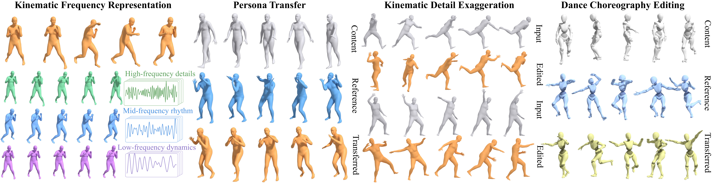
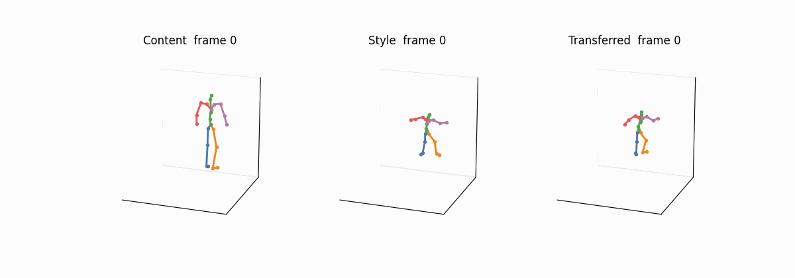
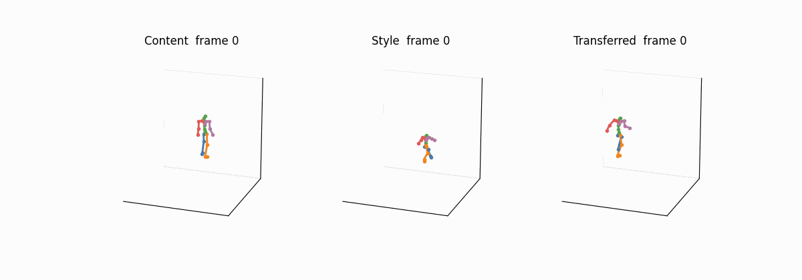
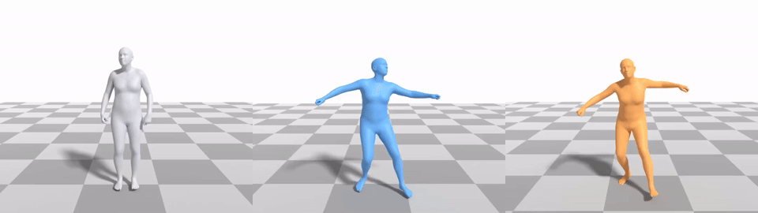
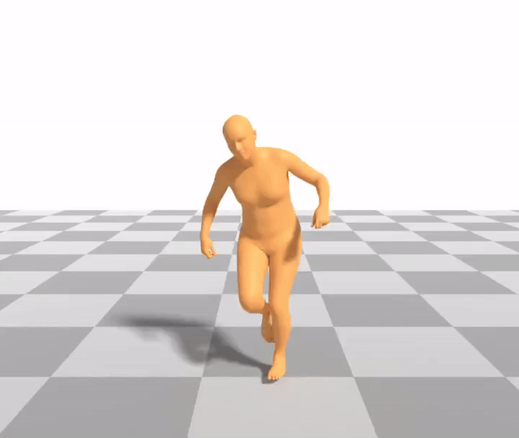

# Learning Kinematic Frequency-Aware Disentanglement for Motion Style Transfer and Editing

[](https://colab.research.google.com/github/dongran/kinematic-frequency-motion/blob/main/notebooks/kinematic_frequency_demo.ipynb)

This repository accompanies **SIGGRAPH Asia 2026** and provides:

- inference code for the dual-style latent diffusion model
- the Colab notebook and the example HumanML-263 clips
- the checksums for the five released weight files



Paper figures and results are on the project page:
[kinematic-frequency-motion](https://www.dr-lab.org/projects/kinematic-frequency-motion/).

This repository runs the transfer and writes joint positions. Mesh rendering is a separate Blender step and needs an SMPL body model, which is not included. Training follows the four scripts below. The FineMotion clips themselves are not in this repository.

### Weights

Five files, about 2.4 GB in total. Click a name to download that file into the path shown in the first column.

| File | Size | What it is |
| --- | --- | --- |
| [`checkpoints/motion_vae.ckpt`](https://www.dr-lab.org/projects/kinematic-frequency-motion/releases/checkpoints/motion_vae.ckpt) | 929 MB | Motion VAE, epoch 599. Latent shape 7 × 256. Frozen during diffusion training. |
| [`checkpoints/imf_extractor.pt`](https://www.dr-lab.org/projects/kinematic-frequency-motion/releases/checkpoints/imf_extractor.pt) | 91 MB | Three-band IMF extractor. Frozen. Do not replace this file with a later extractor. |
| [`checkpoints/contact_timing.pt`](https://www.dr-lab.org/projects/kinematic-frequency-motion/releases/checkpoints/contact_timing.pt) | 1.0 MB | Content-side contact-timing predictor. Frozen. |
| [`checkpoints/motionclip_checkpoint/motionclip.pth.tar`](https://www.dr-lab.org/projects/kinematic-frequency-motion/releases/checkpoints/motionclip_checkpoint/motionclip.pth.tar) | 217 MB | MotionCLIP. Frozen. It supplies the coarse style token. |
| [`checkpoints/dual_style_denoiser.ckpt`](https://www.dr-lab.org/projects/kinematic-frequency-motion/releases/checkpoints/dual_style_denoiser.ckpt) | 1.03 GB | Dual-style denoiser, epoch 1999. This is the network that was trained. |

`checkpoints/SHA256SUMS` lists the SHA-256 of each file. CLIP ViT-B/32 is not one of these five files. The `clip` package downloads it on the first run.

```bash
mkdir -p checkpoints/motionclip_checkpoint
cd checkpoints
curl -L -O https://www.dr-lab.org/projects/kinematic-frequency-motion/releases/checkpoints/motion_vae.ckpt
curl -L -O https://www.dr-lab.org/projects/kinematic-frequency-motion/releases/checkpoints/imf_extractor.pt
curl -L -O https://www.dr-lab.org/projects/kinematic-frequency-motion/releases/checkpoints/contact_timing.pt
curl -L -O https://www.dr-lab.org/projects/kinematic-frequency-motion/releases/checkpoints/dual_style_denoiser.ckpt
curl -L -o motionclip_checkpoint/motionclip.pth.tar \
  https://www.dr-lab.org/projects/kinematic-frequency-motion/releases/checkpoints/motionclip_checkpoint/motionclip.pth.tar
```

### Training

The released weights were trained in this order, on FineMotion motions stored as HumanML-263 features at 20 Hz. `configs/assets_finemotion.yaml` points at that set. One GPU is enough for each script. The diffusion code is `mld`. The IMF extractor code is `imf_extractor`.

#### Step 1: Motion VAE

An encoder–decoder transformer: 9 layers, 4 heads, feed-forward size 1024, latent shape 7 × 256. AdamW, learning rate `1e-4`, batch size 128. The config runs for 1000 epochs. The released file is epoch 599, and it stays frozen after this step.

```bash
bash scripts/train_motion_vae.sh
```

#### Step 2: IMF extractor

The extractor writes three intrinsic mode functions at 20 Hz over 69 degrees of freedom: root rotation, the 63 body rotations, and root translation. Bands 0 and 1 are the fine style. Band 2 is the coarse band. The trajectory branch of the denoiser reads degrees of freedom 66–69.

The released teacher is not a from-scratch run. It continues a pose-69 extractor and updates only the body-63 decoders and refiners, for 8 epochs at learning rate `1e-6` and batch size 128. Put that pose-69 checkpoint at `checkpoints/imf_pose69_init.pt`. The file used by the diffusion model is epoch 6 of this finetune. Do not replace it with a later extractor.

```bash
bash scripts/train_imf_extractor.sh
```

The loss weights are in `configs/imf_pose69_teacher.yaml`: decomposition `1.0`, EMD `0.5`, Hilbert amplitude and frequency `0.5` each inside the Hilbert term, plus a small body-63 temporal penalty.

#### Step 3: Contact-timing predictor

A small temporal network on hip contact, hidden size 64, 4 blocks, kernel size 5. It trains for 40 epochs, batch size 64, AdamW at `1e-4`. Each FineMotion clip needs a contact label `.npz` under the `DATA.LABEL_ROOT` path in `configs/contact_timing_finemotion.yaml`. The released file is the best checkpoint of this run. It stays frozen. MotionCLIP is also frozen; CLIP ViT-B/32 supplies its text and motion embedding.

```bash
bash scripts/train_contact_timing.sh
```

#### Step 4: Dual-style denoiser

Train this network from scratch. The motion VAE, the IMF extractor, the contact-timing predictor, and MotionCLIP stay frozen. The denoiser is a transformer encoder with the same 9 layers, 4 heads, and feed-forward size 1024. Fine style is injected from layer 6. The denoiser also learns its own contact-timing encoder, hidden size 128, output size 512, 2 blocks, kernel size 5. Those weights are inside `dual_style_denoiser.ckpt`.

AdamW, learning rate `1e-4`, batch size 128, 2000 epochs. The released file is epoch 1999. Each condition is dropped with probability 0.25. The diffusion losses in `configs/dual_style_finemotion_scratch.yaml` are:

- reconstruction, generation, and cross-reconstruction: `1.0`
- IMF reconstruction: `0.1`
- HHT amplitude and HHT frequency: `0.02` each
- global frequency and branch frequency: `0.01` and `0.1`
- KL: `1e-4`
- latent: `1e-5`

```bash
bash scripts/train_dual_style.sh
```

Normalization uses `data/stats/Mean.npy` and `data/stats/Std.npy`. Sampling is separate from those loss weights. Inference uses DDIM with 50 steps. The paper protocol is global scale **2.5** and fine scale **1.5**.

### Run a transfer

```bash
pip install -r requirements.txt
bash scripts/run_demo.sh
```

`scripts/run_demo.sh` uses the turning-walk example at the paper scales. The qualitative dance setting is:

```bash
STYLE_SCALE=2.5 FINE_SCALE=10 bash scripts/run_demo.sh
```

The command writes two joint files:

- `outputs/.../joints_raw/*.npy` is the diffusion output. Paper numbers use this file.
- `outputs/.../joints/*.npy` is the same motion after the foot-contact lock. Render this file.

Foot cleanup is on by default and only moves joint positions. Pass `--no_foot_fix` to skip it.

The first cell of the notebook clones this repository and downloads the five weight files. In the example cell, `FOOT_FIX = False` shows the raw joints.

### Your own motions

Use a raw HumanML3D feature, shape `[T, 263]`, 20 Hz. Do not normalize it yourself.

SMPL motion (`poses` and `trans` in an `.npz`) is converted by the [HumanML3D](https://github.com/EricGuo5513/HumanML3D) notebooks `raw_pose_processing.ipynb` and then `motion_representation.ipynb`. Keep the `new_joint_vecs` array.

A motion-capture BVH file is not read here. Retarget it to SMPL with [tempo-changing-music2motion](https://github.com/dongran/tempo-changing-music2motion), then run the two HumanML3D notebooks.

### Generated motions

Both stick figures are rendered after the default foot-contact cleanup.

Turning walk with a dance-kick style, coarse scale 2.5 and fine scale 10.



Stair walk with an energetic style, coarse scale 2.5 and fine scale 3. The camera keeps one scale for the whole clip, so the step up and the step down stay visible.



### Mesh rendering

The same transfers can be drawn as an SMPL mesh in Blender. This step is not part of the Colab notebook. Install [Blender](https://www.blender.org/download/) yourself. The SMPL body model is not in this repository: download `SMPL_NEUTRAL.pkl` from the [SMPL website](https://smpl.is.tue.mpg.de/) and place it at `third_party/smpl/SMPL_NEUTRAL.pkl`.

The renderer reads an `.npz` with `poses` and `trans`. `tools/motion_ik_smpl_bvh.py` can fit that file from a HumanML-263 clip or from the `joints` array written by the transfer, using [joints2smpl](https://github.com/Wangt-CN/Joints2SMPL). Then:

```bash
BLENDER_BIN=/path/to/blender SMPL_PATH=third_party/smpl \
  bash scripts/render_mesh_blender.sh outputs/mesh/smpl_poses_mesh.npz outputs/mesh.mp4
```

These two clips are Blender renders of the transfers above.





### Citation

```bibtex
@inproceedings{dong2026kinematic,
  title={Learning Kinematic Frequency-Aware Disentanglement for Motion Style Transfer and Editing},
  author={Dong, Ran and Xie, Haoran and Yang, Xi},
  booktitle={SIGGRAPH Asia 2026 Conference Papers},
  year={2026},
  note={to appear}
}
```
