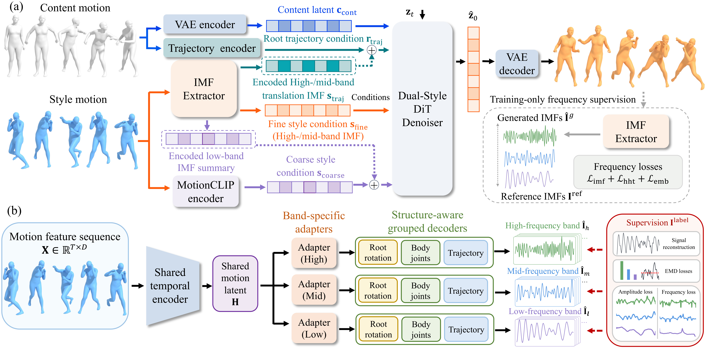

# Learning Kinematic Frequency-Aware Disentanglement for Motion Style Transfer and Editing

[](https://colab.research.google.com/github/dongran/kinematic-frequency-motion/blob/main/notebooks/kinematic_frequency_demo.ipynb)

This repository accompanies **SIGGRAPH Asia 2026**.


Paper figures and results are on the project page:
[kinematic-frequency-motion](https://www.dr-lab.org/projects/kinematic-frequency-motion/).

## Demonstration

The transfer writes joint positions. The Colab notebook clones this repository and downloads the five weight files.

### Weights

The figure is the released model. Panel (a) is one transfer. Panel (b) is the IMF extractor that splits a motion into high, mid, and low bands. Five files, about 2.4 GB in total, cover the blocks below. Use the five files together.



The content motion is encoded by the motion VAE into a content latent, and its root path is a separate trajectory condition. The style motion is passed through the IMF extractor. High and mid bands become the fine-style condition. A summary of the low band is encoded by MotionCLIP into the coarse-style token. The dual-style denoiser produces a latent, and the VAE decoder turns that latent back into a motion. The dashed box on the right is training supervision drawn on the figure.

`contact_timing.pt` predicts foot contact on the content motion and conditions the trajectory branch. The denoiser also has its own contact-timing encoder inside `dual_style_denoiser.ckpt`.

| File | Size | What it is |
| --- | --- | --- |
| [`checkpoints/motion_vae.ckpt`](https://www.dr-lab.org/projects/kinematic-frequency-motion/releases/checkpoints/motion_vae.ckpt) | 929 MB | Motion VAE. It encodes the content motion. |
| [`checkpoints/imf_extractor.pt`](https://www.dr-lab.org/projects/kinematic-frequency-motion/releases/checkpoints/imf_extractor.pt) | 91 MB | Three-band IMF extractor paired with the released denoiser. |
| [`checkpoints/contact_timing.pt`](https://www.dr-lab.org/projects/kinematic-frequency-motion/releases/checkpoints/contact_timing.pt) | 1.0 MB | Content-side contact-timing predictor. |
| [`checkpoints/motionclip_checkpoint/motionclip.pth.tar`](https://www.dr-lab.org/projects/kinematic-frequency-motion/releases/checkpoints/motionclip_checkpoint/motionclip.pth.tar) | 217 MB | Trained [MotionCLIP from MCM-LDM](https://github.com/XingliangJin/MCM-LDM). It supplies the coarse style token. |
| [`checkpoints/dual_style_denoiser.ckpt`](https://www.dr-lab.org/projects/kinematic-frequency-motion/releases/checkpoints/dual_style_denoiser.ckpt) | 1.03 GB | Dual-style denoiser paired with the released IMF extractor. |

`checkpoints/SHA256SUMS` lists the SHA-256 of each file. The `clip` package downloads CLIP ViT-B/32 on the first run.

```bash
mkdir -p checkpoints/motionclip_checkpoint
cd checkpoints
curl -L -O https://www.dr-lab.org/projects/kinematic-frequency-motion/releases/checkpoints/motion_vae.ckpt
curl -L -O https://www.dr-lab.org/projects/kinematic-frequency-motion/releases/checkpoints/imf_extractor.pt
curl -L -O https://www.dr-lab.org/projects/kinematic-frequency-motion/releases/checkpoints/contact_timing.pt
curl -L -O https://www.dr-lab.org/projects/kinematic-frequency-motion/releases/checkpoints/dual_style_denoiser.ckpt
curl -L -o motionclip_checkpoint/motionclip.pth.tar \
  https://www.dr-lab.org/projects/kinematic-frequency-motion/releases/checkpoints/motionclip_checkpoint/motionclip.pth.tar
```

### Run a transfer

```bash
pip install -r requirements.txt
bash scripts/run_demo.sh
```

`scripts/run_demo.sh` uses the turning-walk example at the paper scales, global **2.5** and fine **1.5**. The qualitative dance setting is:

```bash
STYLE_SCALE=2.5 FINE_SCALE=10 bash scripts/run_demo.sh
```

The command writes two joint files:

- `outputs/.../joints_raw/*.npy` is the diffusion output. Paper numbers use this file.
- `outputs/.../joints/*.npy` is the same motion after the foot-contact lock. Render this file.

Foot cleanup is on by default and only moves joint positions. Pass `--no_foot_fix` to skip it. In the notebook example cell, `FOOT_FIX = False` shows the raw joints. Inference uses DDIM with 50 steps.

### Your own test clips

A test clip is a raw HumanML-263 feature, shape `[T, 263]`, at 20 Hz. Leave the array unnormalized. Point the demo at your folders:

```bash
CONTENT_DIR=path/to/content STYLE_DIR=path/to/style bash scripts/run_demo.sh
```

SMPL motion (`poses` and `trans` in an `.npz`) is converted by the [HumanML3D](https://github.com/EricGuo5513/HumanML3D) notebooks `raw_pose_processing.ipynb` and then `motion_representation.ipynb`. Keep the `new_joint_vecs` array. A BVH file is retargeted to SMPL with [tempo-changing-music2motion](https://github.com/dongran/tempo-changing-music2motion), then passed through those two notebooks.

### Generated motions

Both stick figures are rendered after the default foot-contact cleanup.

Turning walk with a dance-kick style, coarse scale 2.5 and fine scale 10.


Stair walk with an energetic style, coarse scale 2.5 and fine scale 3. The camera keeps one scale for the whole clip, so the step up and the step down stay visible.


### Mesh rendering

The same transfers can be drawn as an SMPL mesh in Blender. This step is outside the Colab notebook. Install [Blender](https://www.blender.org/download/) yourself. The SMPL body model is separate: download `SMPL_NEUTRAL.pkl` from the [SMPL website](https://smpl.is.tue.mpg.de/) and place it at `third_party/smpl/SMPL_NEUTRAL.pkl`.

The renderer reads an `.npz` with `poses` and `trans`. `tools/motion_ik_smpl_bvh.py` can fit that file from a HumanML-263 clip or from the `joints` array written by the transfer, using [joints2smpl](https://github.com/wangsen1312/joints2smpl). Then:

```bash
BLENDER_BIN=/path/to/blender SMPL_PATH=third_party/smpl \
  bash scripts/render_mesh_blender.sh outputs/mesh/smpl_poses_mesh.npz outputs/mesh.mp4
```

One example, the turning walk with a dance-kick style at coarse 2.5 and fine 10. Left to right: content in gray, style in blue, and the transfer in orange.


## Train on your own data

The released weights were trained on [FineMotion-Style](https://github.com/dongran/finemotion-style), a benchmark for fine-grained motion style transfer and editing. It brings together CG motion from several sources and covers four style categories: Impact, Strike, Balance, and Shake. A new motion set needs its own frequency bands, its own IMF extractor, and a denoiser trained with that extractor.

### Data preparation

HumanML-263 at 20 Hz is the feature layout.

#### Fit the motion to SMPL

Store each clip as an SMPL-24 `.npz`: `poses` is axis-angle with shape `(T, 24, 3)`, and `trans` is the root translation with shape `(T, 3)`. A motion that is already SMPL can be saved in that form. A BVH file, or another skeleton, is retargeted to SMPL first with [tempo-changing-music2motion](https://github.com/dongran/tempo-changing-music2motion). The paper unifies source captures at 30 Hz before the 20 Hz step below.

#### HumanML-263 features

Convert that SMPL motion into a raw HumanML-263 array, shape `[T, 263]`, at 20 Hz. Leave the array unnormalized. The [HumanML3D](https://github.com/EricGuo5513/HumanML3D) notebooks `raw_pose_processing.ipynb` and `motion_representation.ipynb` do this from SMPL parameters: they recover the 22 joints, place the body on the floor, and write `new_joint_vecs`. Keep that array. Clips used for training are 40 to 196 frames at 20 Hz. The motion VAE and the denoiser read this array.

#### MEMD and the three dataset frequencies

The frequency labels come from the SMPL pose. Resample `poses` and `trans` to 20 Hz and stack a 69-D signal: root rotation, the 21 body joints, and root translation. Multivariate EMD decomposes that signal into mode-aligned intrinsic mode functions. Different clips produce different numbers of modes, so an IMF index is not yet a shared high, mid, or low band.

For the dataset, drop the residual and keep modes whose amplitude-weighted frequency is at least 0.5 Hz. Take the three modes with the largest amplitude, sort them by frequency, and average each rank across the dataset. Those three numbers are the high, mid, and low frequencies of this motion set. Each clip is then aligned by assigning its valid modes to the nearest of those frequencies, without using the same mode twice. A clip with fewer than three valid modes is left out of the supervision set. This is the adaptive frequency-band alignment in the paper supplement.

```bash
python scripts/prepare_frequency_bands.py \
  --smpl_dir data/smpl_npz \
  --out_dir data/frequency_bands
```

`data/frequency_bands/aligned/*.npz` stores the three bands in high, mid, low order. Those files are the labels for the IMF extractor. Each input take should be at least 70 frames at 20 Hz, because the 69-D signal needs more frames than channels. The released labels use 160 MEMD projection directions.

### Training

Train on the HumanML-263 features and the aligned frequency bands. `configs/assets_finemotion.yaml` points at the [FineMotion-Style](https://github.com/dongran/finemotion-style) clips used for the released weights. One GPU is enough for each script. The diffusion code is `mld`. The IMF extractor code is `imf_extractor`. Layer sizes, learning rates, and loss weights are in the YAML file for each step. Steps 1–3 produce the files that stay fixed, and step 4 trains the denoiser.

Normalization uses `data/stats/Mean.npy` and `data/stats/Std.npy`.

#### Step 1: Motion VAE

Train the motion VAE, then keep it fixed. Settings are in `configs/motion_vae_finemotion.yaml`.

```bash
bash scripts/train_motion_vae.sh
```

#### Step 2: IMF extractor

Train the IMF extractor before the denoiser, on the three aligned bands. It learns to split a motion into those high, mid, and low bands, and the denoiser uses the bands to disentangle style from content. A different motion set needs its own bands and its own extractor. Settings are in `configs/imf_pose69_teacher.yaml`.

```bash
bash scripts/train_imf_extractor.sh
```

#### Step 3: Contact-timing predictor

Train the foot-contact predictor on the content motion, then keep it fixed. Each clip needs a contact-label `.npz` under `DATA.LABEL_ROOT` in `configs/contact_timing_finemotion.yaml`.

```bash
bash scripts/train_contact_timing.sh
```

#### MotionCLIP

The coarse-style token uses a trained MotionCLIP checkpoint from [MCM-LDM](https://github.com/XingliangJin/MCM-LDM) ([project page](https://xingliangjin.github.io/MCM-LDM-Web/)). This repository includes that file. For a finer-grained or custom token on your own data, retrain MotionCLIP.

#### Step 4: Dual-style denoiser

Train the denoiser with the motion VAE, the IMF extractor, the contact-timing predictor, and MotionCLIP fixed. Settings and loss weights are in `configs/dual_style_finemotion_scratch.yaml`.

```bash
bash scripts/train_dual_style.sh
```

## Citation

```bibtex
@inproceedings{dong2026kinematic,
  title={Learning Kinematic Frequency-Aware Disentanglement for Motion Style Transfer and Editing},
  author={Dong, Ran and Xie, Haoran and Yang, Xi},
  booktitle={SIGGRAPH Asia 2026 Conference Papers},
  year={2026},
  note={to appear}
}
```
