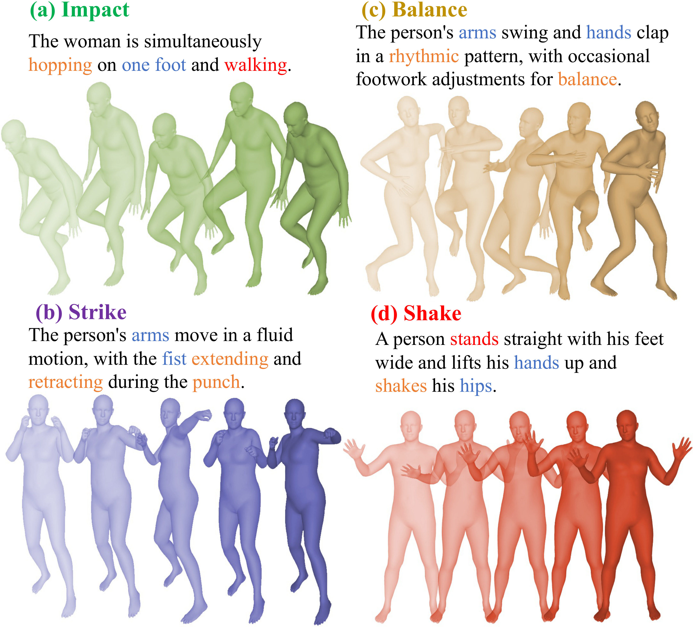
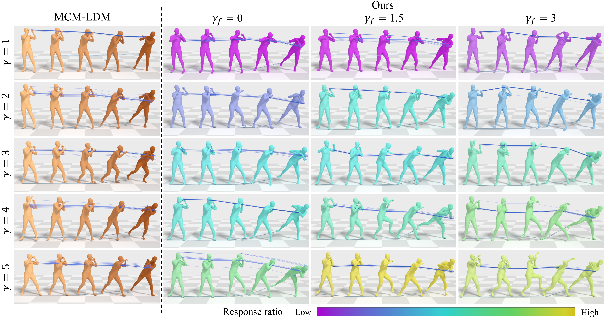
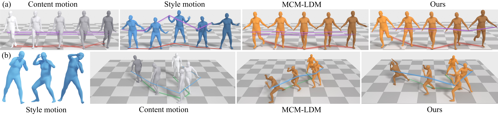
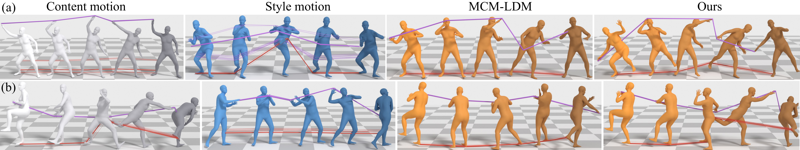
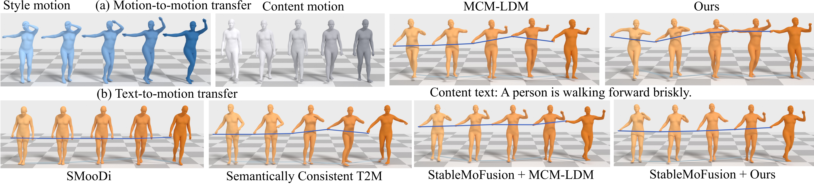
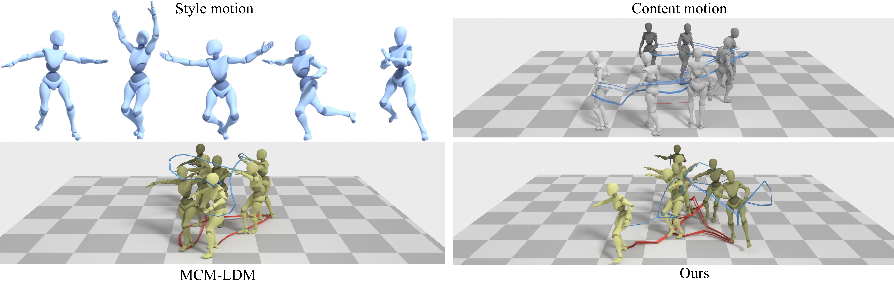
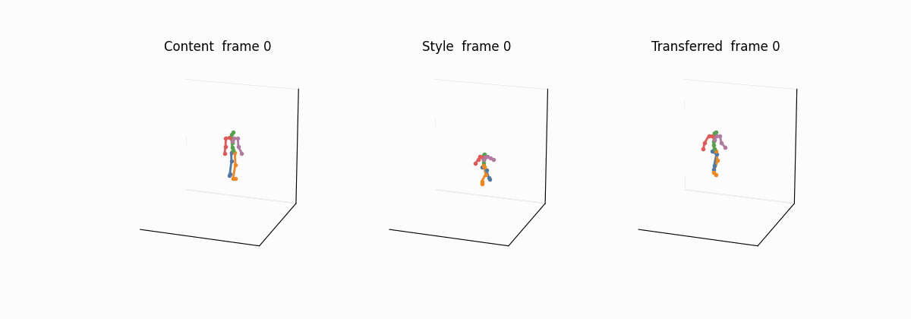

# Learning Kinematic Frequency-Aware Disentanglement for Motion Style Transfer and Editing

This repository accompanies **SIGGRAPH Asia 2026** and provides:

- a **kinematic frequency** representation that separates coarse style from fine detail
- a **dual-style** latent diffusion model for motion-to-motion transfer and editing
- inference code, a Colab notebook, and the stick-figure demo


This repository provides companion code for the paper **“Learning Kinematic Frequency-Aware Disentanglement for Motion Style Transfer and Editing”** (SIGGRAPH Asia 2026, to appear) and the project page:
[kinematic-frequency-motion](https://www.dr-lab.org/projects/kinematic-frequency-motion/).

The checkpoints are large, so they are distributed from the project page. This repository runs the transfer and writes joint positions. It does not include SMPL mesh or Blender rendering.

### Network

The content motion supplies a content latent and a root-trajectory condition. The style reference supplies coarse, fine, and trajectory-frequency conditions. A Dual-Style Diffusion Transformer denoises the latent, and the motion VAE decodes it back to a pose sequence. A separate IMF extractor turns the motion into high-, mid-, and low-frequency bands for the root, the body, and the trajectory.


### Fine-style examples

The benchmark groups fine style into impact, strike, balance, and shake. These are the local details the fine branch is meant to carry, while the content action stays in place.



With the content and the style reference fixed, the global scale changes the overall transfer and the fine scale changes the local detail. The right-hand grid is this model. Brighter yellow means a stronger high-frequency response.



### Editing results

Persona transfer keeps the content action and takes on another person’s stepping, timing, and secondary motion.



The same action can be exaggerated by turning the fine-style scale up, as in the hand motion and the throw.



Dance editing moves dance phrasing onto a simpler walk. The route of the walk stays readable.





### Repository layout

- `demo_dual_style.py` – one content motion, one coarse style, one fine style
- `data/examples/` – HumanML3D clips, shape `[T, 263]`, 20 Hz, not pre-normalized
- `notebooks/dual_style_transfer_demo.ipynb` – the same transfer as stick figures on a free Colab T4
- `mld_clean/` – denoiser, motion VAE, and the visualization foot-contact cleanup
- `checkpoints/SHA256SUMS` – names, sizes, and checksums of the weights

### Quick start

1. Install dependencies:

   ```bash
   pip install -r requirements.txt
   ```

2. Download the five checkpoints into `checkpoints/`. The list is `checkpoints/SHA256SUMS`.

   https://www.dr-lab.org/projects/kinematic-frequency-motion/releases/

3. Run the turning-walk example. The paper protocol is global scale **2.5** and fine scale **1.5**.

   ```bash
   bash scripts/run_demo.sh
   ```

   The qualitative dance setting uses fine scale 10:

   ```bash
   STYLE_SCALE=2.5 FINE_SCALE=10 bash scripts/run_demo.sh
   ```

The command writes two joint files:

- `outputs/.../joints_raw/*.npy` – diffusion output before cleanup. Paper numbers use this file.
- `outputs/.../joints/*.npy` – after the foot-contact lock. This is the file to render.

Foot cleanup is on by default. It only moves joint positions. Pass `--no_foot_fix` to skip it.

The code demo also saves stick-figure comparisons. One is the turning walk at coarse 2.5 and fine 10. The stair pair keeps a single spatial scale, so the step up and the step down stay visible when the fine scale changes from 0 to 3.





### Notebook

[Open in Colab](https://colab.research.google.com/github/dongran/kinematic-frequency-motion/blob/main/notebooks/dual_style_transfer_demo.ipynb)

The first cell clones this repository and downloads only the checkpoints. In the example cell, `FOOT_FIX = False` shows the raw joints.

### Your own motions

Use a raw HumanML3D feature, shape `[T, 263]`, 20 Hz. Do not normalize it yourself. This demo applies `data/stats/Mean.npy` and `data/stats/Std.npy`.

SMPL motion (`poses` and `trans` in an `.npz`) is converted by the [HumanML3D](https://github.com/EricGuo5513/HumanML3D) notebooks `raw_pose_processing.ipynb` and then `motion_representation.ipynb`. Keep the `new_joint_vecs` array, not a pre-normalized copy.

A motion-capture BVH file is not read here. Retarget it to SMPL with [tempo-changing-music2motion](https://github.com/dongran/tempo-changing-music2motion), then run the two HumanML3D notebooks.

### Citation

```bibtex
@inproceedings{dong2026kinematic,
  title={Learning Kinematic Frequency-Aware Disentanglement for Motion Style Transfer and Editing},
  author={Dong, Ran and Xie, Haoran and Yang, Xi},
  booktitle={SIGGRAPH Asia 2026 Conference Papers},
  year={2026},
  note={to appear}
}
```
